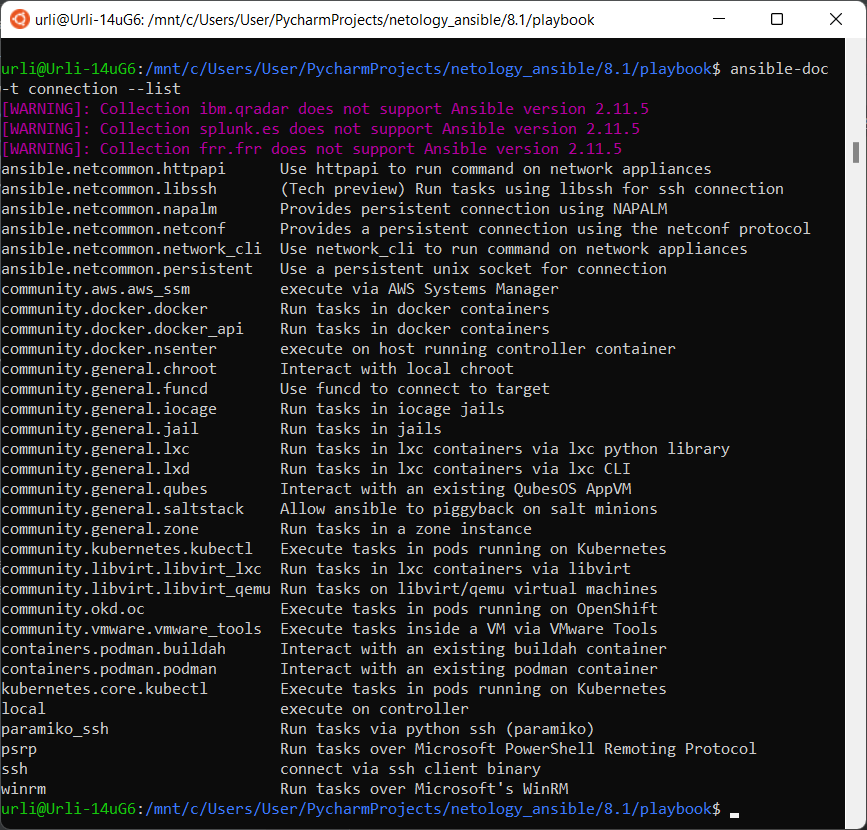

# Домашнее задание к занятию "08.01 Введение в Ansible"

## Подготовка к выполнению
1. Установите ansible версии 2.10 или выше.
2. Создайте свой собственный публичный репозиторий на github с произвольным именем.
        
[github netology_ansible](https://github.com/urli-by/netology_ansible.git)
3. Скачайте [playbook](./playbook/) из репозитория с домашним заданием и перенесите его в свой репозиторий.

## Основная часть
1. Попробуйте запустить playbook на окружении из `test.yml`, зафиксируйте какое значение имеет факт `some_fact` для указанного хоста при выполнении playbook'a.

```commandline
urli@Urli-14uG6:/mnt/c/users/user/PycharmProjects/netology_ansible/8.1/playbook$ ansible-playbook -i inventory/test.yml
site.yml

TASK [Print fact] ******************************************************************************************************
ok: [localhost] => {
    "msg": 12
}
```
2. Найдите файл с переменными (group_vars) в котором задаётся найденное в первом пункте значение и поменяйте его на 'all default fact'.

```commandline
TASK [Print fact] ******************************************************************************************************
ok: [localhost] => {
    "msg": "all default fact"
}
```
3. Воспользуйтесь подготовленным (используется `docker`) или создайте собственное окружение для проведения дальнейших испытаний.
```commandline
Для этого пришлось сконвертировать Ubuntu-20.04 WSL 1 в WSL 2 командой
wsl.exe --set-version (distro name) 2
После чего в Docker Desktop добавить 
"Enable integration with additional distros:
Ubuntu-20.04"
После чего ansible и docker начали работать в Ubuntu WSL
```
4. Проведите запуск playbook на окружении из `prod.yml`. Зафиксируйте полученные значения `some_fact` для каждого из `managed host`.

```commandline
urli@Urli-14uG6:/mnt/c/Users/User/PycharmProjects/netology_ansible/8.1/playbook$ ansible-playbook -i inventory/prod.yml site.yml

PLAY [Print os facts] **************************************************************************************************

TASK [Gathering Facts] *************************************************************************************************
[DEPRECATION WARNING]: Distribution Ubuntu 18.04 on host ubuntu should use /usr/bin/python3, but is using
/usr/bin/python for backward compatibility with prior Ansible releases. A future Ansible release will default to using
the discovered platform python for this host. See https://docs.ansible.com/ansible-
core/2.11/reference_appendices/interpreter_discovery.html for more information. This feature will be removed in version
 2.12. Deprecation warnings can be disabled by setting deprecation_warnings=False in ansible.cfg.
ok: [ubuntu]
ok: [centos7]

TASK [Print OS] ********************************************************************************************************
ok: [centos7] => {
    "msg": "CentOS"
}
ok: [ubuntu] => {
    "msg": "Ubuntu"
}

TASK [Print fact] ******************************************************************************************************
ok: [centos7] => {
    "msg": "el"
}
ok: [ubuntu] => {
    "msg": "deb"
}

PLAY RECAP *************************************************************************************************************
centos7                    : ok=3    changed=0    unreachable=0    failed=0    skipped=0    rescued=0    ignored=0
ubuntu                     : ok=3    changed=0    unreachable=0    failed=0    skipped=0    rescued=0    ignored=0
```
5. Добавьте факты в `group_vars` каждой из групп хостов так, чтобы для `some_fact` получились следующие значения: для `deb` - 'deb default fact', для `el` - 'el default fact'.
6.  Повторите запуск playbook на окружении `prod.yml`. Убедитесь, что выдаются корректные значения для всех хостов.

```commandline
TASK [Print fact] ******************************************************************************************************
ok: [centos7] => {
    "msg": "el default fact"
}
ok: [ubuntu] => {
    "msg": "deb default fact"
}
```
7. При помощи `ansible-vault` зашифруйте факты в `group_vars/deb` и `group_vars/el` с паролем `netology`.

```commandline
urli@Urli-14uG6:/mnt/c/Users/User/PycharmProjects/netology_ansible/8.1/playbook$ ansible-vault encrypt group_vars/deb/examp.yml group_vars/el/examp.yml
New Vault password:
Confirm New Vault password:
Encryption successful
```
8. Запустите playbook на окружении `prod.yml`. При запуске `ansible` должен запросить у вас пароль. Убедитесь в работоспособности.

```commandline
urli@Urli-14uG6:/mnt/c/Users/User/PycharmProjects/netology_ansible/8.1/playbook$ ansible-playbook -i inventory/prod.yml site.yml

PLAY [Print os facts] **************************************************************************************************
ERROR! Attempting to decrypt but no vault secrets found
---
urli@Urli-14uG6:/mnt/c/Users/User/PycharmProjects/netology_ansible/8.1/playbook$ ansible-playbook -i inventory/prod.yml site.yml --ask-vault-pass
Vault password:

PLAY [Print os facts] **************************************************************************************************

TASK [Gathering Facts] *************************************************************************************************

```
9. Посмотрите при помощи `ansible-doc` список плагинов для подключения. Выберите подходящий для работы на `control node`.

```commandline
А вот тут непонятно, что имеется ввиду под control node.
речь идёт про докер, с помощью которого осуществляется подключение к хостам?
community.docker.docker        Run tasks in docker containers
```
10. В `prod.yml` добавьте новую группу хостов с именем  `local`, в ней разместите localhost с необходимым типом подключения.

```yaml
---
  el:
    hosts:
      centos7:
        ansible_connection: docker
  deb:
    hosts:
      ubuntu:
        ansible_connection: docker
  local:
    hosts:
      localhost:
        ansible_connection: local
```
11. Запустите playbook на окружении `prod.yml`. При запуске `ansible` должен запросить у вас пароль. Убедитесь что факты `some_fact` для каждого из хостов определены из верных `group_vars`.

```commandline
urli@Urli-14uG6:/mnt/c/Users/User/PycharmProjects/netology_ansible/8.1/playbook$ ansible-playbook -i inventory/prod.yml site.yml --ask-vault-pass
Vault password:

PLAY [Print os facts] ***********************************************************************
TASK [Gathering Facts] **********************************************************************ok: [localhost]
[DEPRECATION WARNING]: Distribution Ubuntu 18.04 on host ubuntu should use /usr/bin/python3,
 but is using /usr/bin/python for backward compatibility with prior Ansible releases. A
future Ansible release will default to using the discovered platform python for this host.
See https://docs.ansible.com/ansible-
core/2.11/reference_appendices/interpreter_discovery.html for more information. This feature
 will be removed in version 2.12. Deprecation warnings can be disabled by setting
deprecation_warnings=False in ansible.cfg.
ok: [ubuntu]
ok: [centos7]

TASK [Print OS] *****************************************************************************
ok: [localhost] => {
    "msg": "Ubuntu"
}
ok: [centos7] => {
    "msg": "CentOS"
}
ok: [ubuntu] => {
    "msg": "Ubuntu"
}

TASK [Print fact] ***************************************************************************
ok: [localhost] => {
    "msg": "all default fact"
}
ok: [centos7] => {
    "msg": "el default fact"
}
ok: [ubuntu] => {
    "msg": "deb default fact"
}

PLAY RECAP **********************************************************************************
centos7                    : ok=3    changed=0    unreachable=0    failed=0    skipped=0    rescued=0    ignored=0
localhost                  : ok=3    changed=0    unreachable=0    failed=0    skipped=0    rescued=0    ignored=0
ubuntu                     : ok=3    changed=0    unreachable=0    failed=0    skipped=0    rescued=0    ignored=0
```
12. Заполните `README.md` ответами на вопросы. Сделайте `git push` в ветку `master`. В ответе отправьте ссылку на ваш открытый репозиторий с изменённым `playbook` и заполненным `README.md`.

## Необязательная часть

1. При помощи `ansible-vault` расшифруйте все зашифрованные файлы с переменными.

```commandline
urli@Urli-14uG6:/mnt/c/Users/User/PycharmProjects/netology_ansible/8.1/playbook$ ansible-vault decrypt group_vars/deb/examp.yml group_vars/el/examp.yml
Vault password:
Decryption successful
```
2. Зашифруйте отдельное значение `PaSSw0rd` для переменной `some_fact` паролем `netology`. Добавьте полученное значение в `group_vars/all/exmp.yml`.

```commandline
urli@Urli-14uG6:/mnt/c/Users/User/PycharmProjects/netology_ansible/8.1/playbook$ ansible-vault encrypt_string "PaSSw0rd" --name "encrypted_data_string"
New Vault password:
Confirm New Vault password:
encrypted_data_string: !vault |
          $ANSIBLE_VAULT;1.1;AES256
          34366536356563376238613561613636393733353031616131646133366335623262323238663665
          3662653633326334313566313036366335373935323837330a376132653038363037323430663532
          39653335393433643834663962376231383765626638623338323466306436393666373638643936
          3736633835303162390a623034306533623965393366316266306231626238326664373563383664
          6133
Encryption successful
```
```yaml
---
  some_fact: !vault |
          $ANSIBLE_VAULT;1.1;AES256
          34366536356563376238613561613636393733353031616131646133366335623262323238663665
          3662653633326334313566313036366335373935323837330a376132653038363037323430663532
          39653335393433643834663962376231383765626638623338323466306436393666373638643936
          3736633835303162390a623034306533623965393366316266306231626238326664373563383664
          6133
```
3. Запустите `playbook`, убедитесь, что для нужных хостов применился новый `fact`.

```commandline
TASK [Print fact] *************************************************************************************************************************************************************************************************
ok: [localhost] => {
    "msg": "PaSSw0rd"
}
ok: [centos7] => {
    "msg": "el default fact"
}
ok: [ubuntu] => {
    "msg": "deb default fact"
}
```
4. Добавьте новую группу хостов `fedora`, самостоятельно придумайте для неё переменную. В качестве образа можно использовать [этот](https://hub.docker.com/r/pycontribs/fedora).

```commandline
urli@Urli-14uG6:/mnt/c/Users/User/PycharmProjects/netology_ansible/8.1/playbook$ docker pull pycontribs/fedora:latest
latest: Pulling from pycontribs/fedora
588cf1704268: Pull complete
49425a0e12c7: Pull complete
Digest: sha256:20eeb45ef6e394947058dc24dc2bd98dfb7a8fecbbe6363d14ab3170f10a27ab
Status: Downloaded newer image for pycontribs/fedora:latest
docker.io/pycontribs/fedora:latest
urli@Urli-14uG6:/mnt/c/Users/User/PycharmProjects/netology_ansible/8.1/playbook$ docker run -d --name fedora pycontribs/fedora:latest sleep 600000
548c6a6492a4048c6f03e6dcc52246d842ad3440972fe9065e89edc1e38a9170
```
```yaml
prod.yml
---
  el:
    hosts:
      centos7:
        ansible_connection: docker
  deb:
    hosts:
      ubuntu:
        ansible_connection: docker
  fedora:
    hosts:
      fedora:
        ansible_connection: docker
  local:
    hosts:
      localhost:
        ansible_connection: local
```
```commandline
TASK [Print fact] *************************************************************************************************************************************************************************************************
ok: [localhost] => {
    "msg": "PaSSw0rd"
}
ok: [centos7] => {
    "msg": "el default fact"
}
ok: [ubuntu] => {
    "msg": "deb default fact"
}
ok: [fedora] => {
    "msg": "fedora default fact"
}
```
5. Напишите скрипт на bash: автоматизируйте поднятие необходимых контейнеров, запуск ansible-playbook и остановку контейнеров.

```commandline
#!/bin/bash

for i in centos, ubuntu, fedora
do
docker run -d --name $i pycontribs/fedora:latest sleep 600000
done
ansible-playbook -i inventory/prod.yml site.yml --ask-vault-pass
docker stop $(docker ps -a -q)
```
6. Все изменения должны быть зафиксированы и отправлены в вашей личный репозиторий.

---

### Как оформить ДЗ?

Выполненное домашнее задание пришлите ссылкой на .md-файл в вашем репозитории.

---